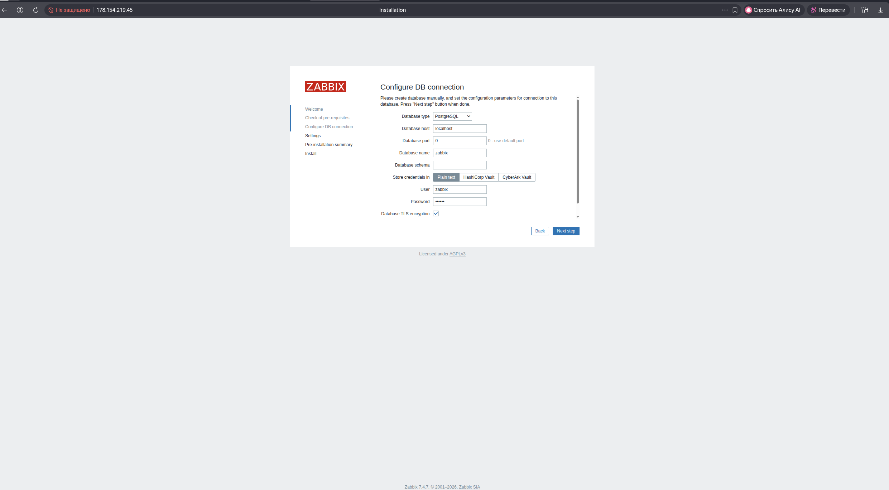
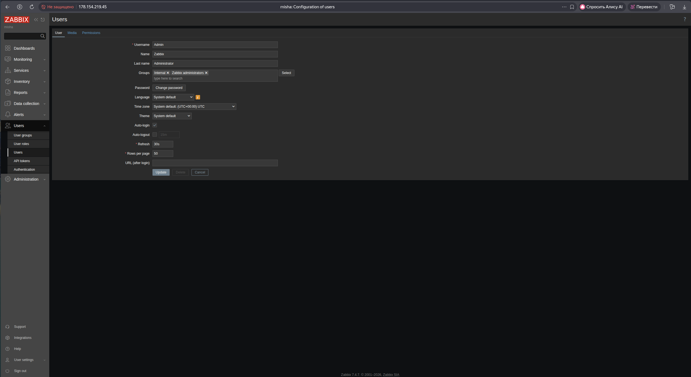
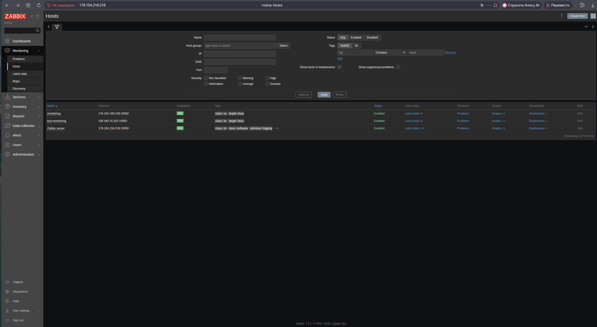

# Домашнее задание к занятию «Система мониторинга Zabbix»
**Выполнил:** Чехлов Михаил


## Задание 1: Установка Zabbix Server


*Тип базы данных — PostgreSQL.*


*Username — «Admin».*


## Задание 2: Установка Zabbix Agent


*Статус хостов (status - enabled).*


*Status zabbix-agent — active(running).*


*Все отображённые метрики имеют статус normal*


### Использованные команды
```bash
# Обновление списка пакетов
sudo apt update

# Установка PostgreSQL
sudo apt install postgresql postgresql-contrib

# Скачивание и установка пакета репозитория Zabbix (версия 7.4 для Ubuntu 24.04)
wget https://repo.zabbix.com/zabbix/7.4/release/ubuntu/pool/main/z/zabbix-release/zabbix-release_latest_7.4+ubuntu24.04_all.deb
sudo dpkg -i zabbix-release_latest_7.4+ubuntu24.04_all.deb

# Обновление списка пакетов после добавления репозитория Zabbix
sudo apt update

# Установка компонентов Zabbix и Apache
sudo apt install zabbix-server-pgsql zabbix-frontend-php php8.3-pgsql zabbix-apache-conf zabbix-sql-scripts zabbix-agent

# Создание базы данных PostgreSQL 
sudo -u postgres createuser --pwprompt zabbix
sudo -u postgres createdb -O zabbix zabbix

# Импорт схемы базы данных
zcat /usr/share/zabbix/sql-scripts/postgresql/server.sql.gz | sudo -u zabbix psql zabbix

# Настройка Zabbix‑сервера: редактирование /etc/zabbix/zabbix_server.conf
# DBPassword=ваш_надёжный_пароль

# Настройка PHP для веб‑интерфейса: редактирование /etc/zabbix/apache.conf
# php_value date.timezone Europe/Moscow

# Запуск и включение служб
sudo systemctl restart zabbix-server apache2
sudo systemctl enable zabbix-server apache2

# Проверка статуса служб
sudo systemctl restart zabbix-server zabbix-agent apache2
sudo systemctl enable zabbix-server zabbix-agent apache2


### Установка и настройка Zabbix Agent (на каждом хосте):

```bash
# Добавление репозитория
wget https://repo.zabbix.com/zabbix/7.4/release/ubuntu/pool/main/z/zabbix-release/zabbix-release_latest_7.4+ubuntu24.04_all.deb
sudo dpkg -i zabbix-release_latest_7.4+ubuntu24.04_all.deb

# Установка агента
sudo apt update
sudo apt install zabbix-agent

# Редактирование конфигурации
sudo nano /etc/zabbix/zabbix_agentd.conf
# В файле: Server=192.168.1.10, ServerActive=192.168.1.10, Hostname=zabbix-server (или additional-host)

# Запуск и автозагрузка
sudo systemctl start zabbix-agent
sudo systemctl enable zabbix-agent
sudo systemctl restart zabbix-agent


